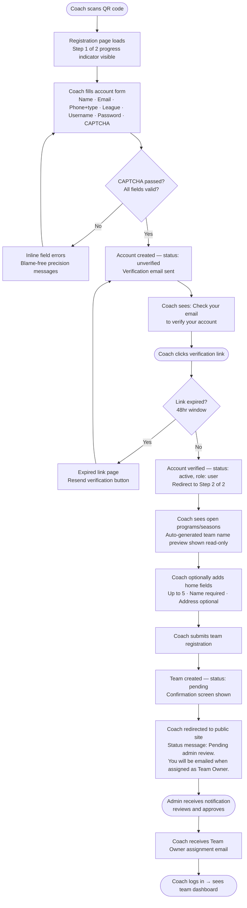
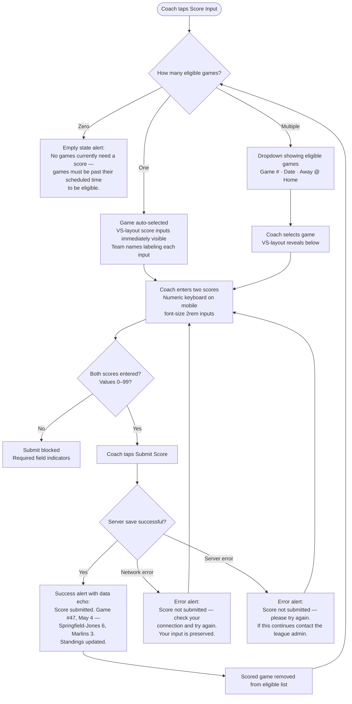
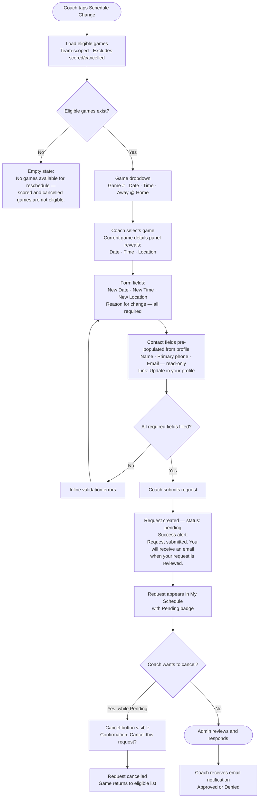
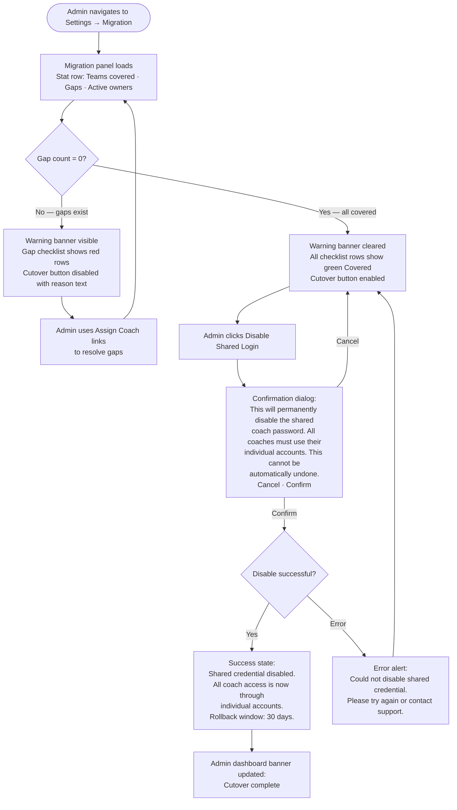
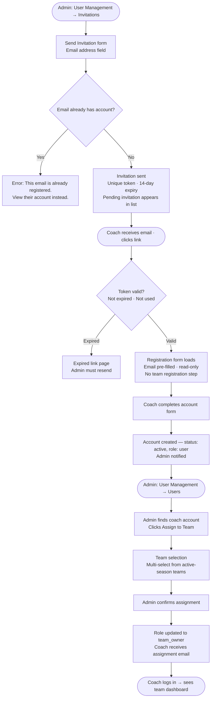

# UX Design Specification — District 8 Travel League: Individual Coach Logins

**Author:** Mike
**Date:** 2026-05-03

---

<!-- UX design content will be appended sequentially through collaborative workflow steps -->

## Executive Summary

### Project Vision

Replace an anonymous shared coach password with individual coach identity — turning a generic portal into a personal team management workspace. The coach goes from "anyone with the password" to "I am the Springfield-Jones coach for the 12U Fall season." Every screen they see is scoped to their team, their games, their actions.

### Target Users

**Primary — Team Owner (Coach/Manager):** Youth travel baseball coaches, typically parents or community volunteers. Varying tech comfort levels. Will use this on their phone at a field, or quickly at home the night after a game. They don't want to think about the tool — they want to submit a score and get back to their life. Registration is a one-time friction event they'll do once, likely on a laptop.

**Secondary — League Administrator:** One or a few power users who manage everything. Comfortable with the existing admin console. Responsible for onboarding coaches, assigning teams, managing the league dropdown, and executing the cutover from the shared credential to individual accounts.

### Key Design Challenges

1. **Registration is the highest-friction moment.** A coach arrives via QR code — cold, no context. The form is long (12 fields including phone types, league dropdown, CAPTCHA) and then flows directly into team registration (program selection, home field locations). A two-stage flow with an email verification gate in the middle. Getting coaches through this without abandonment is the biggest UX risk.

2. **Team-scoping is invisible but must never feel broken.** Once logged in, the coach sees only their world — their games, their schedule. If scoping produces zero results (no games yet assigned, pending team approval), the UI must explain *why* clearly rather than showing empty tables that feel like bugs.

3. **The migration cutover is a high-stakes, one-way admin action.** Disabling the shared password is irreversible in practice. The admin needs confidence (the gap checklist), a sobering confirmation dialog, and a meaningful success state. Getting this wrong locks out coaches.

4. **The existing schedule change form requires coaches to re-enter their contact info manually every time.** With individual accounts, this becomes an opportunity to auto-populate from profile — a clear win enabled by the new auth system.

### Design Opportunities

1. **The dashboard becomes personal.** "Welcome back, Coach Jones — Springfield-Jones has 2 upcoming games" is a fundamentally better experience than today's generic card panel. Personalization costs almost nothing on top of the auth system.

2. **Score submission can be radically simpler.** With team scoping, a coach with one eligible game should land on a nearly pre-filled form. For coaches with exactly one game needing a score, the game selection dropdown could be skipped entirely.

3. **Contact info auto-population eliminates repeat friction.** The schedule change form can pre-fill contact name, phone, and email from the coach's profile, reducing a 3-field manual entry to zero for every subsequent submission.

4. **Registration → first login can feel like a welcome, not a dead end.** The confirmation screen and first-time dashboard state can orient the coach ("Your team registration is pending — you'll get an email when approved") rather than leaving them wondering what happens next.

## Core User Experience

### Defining Experience

The defining coach experience is a **rapid task loop**: a coach opens the app on their phone after a game or during a scheduling conflict, completes one focused action in under a minute, and closes it. The two equally primary actions are **score submission** and **schedule change requests** — both must work flawlessly on mobile, one-handed, in a parking lot.

The most critical flow to nail is score entry: two teams, two numbers, one submit. Every decision that makes this faster and more confident is the right decision.

### Platform Strategy

**Mobile-first, responsive web.** No native app — the existing Bootstrap 5 server-rendered approach is retained. Coach-facing pages are designed for touch interaction on viewports from 375px up, then gracefully enhanced for tablet and desktop. Admin-facing pages are primarily desktop but must not break on mobile.

No offline functionality required. The assumption is a coach has cell signal at or near a field.

### Effortless Interactions

- **Score submission** is the #1 effortlessness target. A coach should be able to open the app, see their eligible game(s), enter two scores, and confirm — ideally in under 30 seconds. For coaches with exactly one eligible game, the game selection step should be eliminated or pre-selected.
- **Schedule change contact info** should never require manual re-entry. The form pre-populates name, primary phone, and email from the coach's account profile automatically.
- **Navigation after login** should immediately surface the coach's team context — no generic dashboard that requires the coach to figure out where they are.

### Critical Success Moments

1. **Score submission confirmation** — "Score submitted. Standings updated." This is the moment the coach feels the tool worked. Must be clear, immediate, and terminal (no ambiguity about whether it saved).
2. **First login after team assignment** — The coach sees their team's name and their games within seconds of logging in. This is the moment individual identity becomes real and tangible.
3. **Registration completion without abandonment** — The two-stage registration flow (account → team) must guide coaches forward with clear progress cues. A coach who finishes registration and lands on the public site should understand exactly what happens next and why they cannot access team tools yet.
4. **Admin cutover confidence** — The admin disables the shared password and sees unambiguous confirmation that the transition is complete. No second-guessing.

### Experience Principles

1. **Team-first, always.** Every screen the coach sees should be scoped to their team. Generic views (all teams, all games) are an admin concept, not a coach concept.
2. **One action, one screen.** Don't make coaches hunt. Score entry is score entry. Schedule change is schedule change. Navigation is direct, not nested behind multiple menus.
3. **Mobile hands win.** Tap targets, input sizes, and form layouts are designed for thumbs. Large score inputs, minimal typing, no tiny links.
4. **Empty states explain themselves.** When a coach has no eligible games to score, or their team registration is pending, the screen tells them why and what comes next — never a bare empty table.
5. **Friction lives in registration, nowhere else.** The one-time registration flow carries the necessary complexity (CAPTCHA, email verify, home fields). After that, every session is fast and frictionless.

## Desired Emotional Response

### Primary Emotional Goals

**For coaches:** Relief through clarity. Coaches are volunteer parents who signed up to coach baseball, not manage software. The emotional win is not delight — it is "that worked, I'm done." The system must close the anxiety loop on every action: did it go through? is my request in? After submitting a score, the coach should feel accomplished and certain, not just finished.

**For admins:** Control and confidence. Admins are managing an active season with multiple coaches at different onboarding stages. They need a clear picture of system state at all times — especially during the high-stakes migration cutover where certainty, not just confirmation, is the goal.

### Emotional Journey Mapping

| Stage | Coach Feeling | Admin Feeling |
|---|---|---|
| First arrival (registration) | Mild friction — expected, tolerated | N/A |
| Email verification wait | Neutral — "ok, I'll check my email" | N/A |
| Waiting for team approval | Informed — "I know where I stand" | In control — clear pending queue |
| First login with team assigned | Recognition — "this is mine" | Satisfied — assignment complete |
| Submitting a score | Focused → certain it worked | Notified, informed |
| Requesting a reschedule | Purposeful → submitted and confirmed | Notified, action required |
| Error occurs | Momentarily stopped → immediately knows what to fix | Stopped → clear path to resolution |
| Admin cutover | N/A | Confident, certain |

### Micro-Emotions

- **Certainty over completion** — coaches should never wonder if their submission went through; confirmation states echo back exactly what was submitted (game, teams, scores)
- **Confidence over confusion** — the system behaves predictably; what the coach sees matches reality
- **Accomplishment over satisfaction** — the emotional reward is task completion with zero residual doubt
- **Control over relief** — for admins, especially at cutover; the UI confirms state clearly and completely

### Design Implications

- **Transactional tone throughout.** Copy is direct and functional. No celebration animations, no congratulatory language. Confirmation states are clear, final, and echo back the specifics of what just happened.
- **Error messages are precise and blame-free, not clinical or apologetic.** Not "Invalid input." Not "Hmm, something went wrong." Instead: "Score not submitted — please check your connection and try again" or "Email is already registered — log in or reset your password." The system describes what failed and what to do next. It does not shame the user or hide information.
- **Confirmation states close the cognitive loop.** "Score submitted. Game #47, May 4 — Marlins 6, Cubs 3." Echoing the specifics back costs nothing in complexity and eliminates the "did it actually save?" anxiety for a coach on spotty field WiFi.
- **Pending state is informational, not motivational.** The waiting-for-approval screen states the coach's status plainly: "Your team registration is pending admin review. You'll receive an email when you've been assigned to your team."
- **Empty states are diagnostic.** "No eligible games to score — games must be past their scheduled time before scores can be submitted." Facts, not friendly illustrations.
- **Admin confidence is built through data.** The cutover checklist is a table of teams and assignment status, not a progress wizard with steps and badges.

### Emotional Design Principles

1. **Respect the clock.** Every interaction assumes the coach has somewhere better to be. Speed and brevity are the primary emotional signals this tool sends.
2. **Close the loop, every time.** Confirmation and error states tell the user exactly what happened — specifically enough that they feel certain, not just informed.
3. **Blame-free precision.** When something fails, the message names what failed and what to fix. It never implies user error; it describes system state and the path forward.
4. **Status is always visible.** Coaches and admins should never have to guess the state of a request, a registration, or the system. Every object shows its current state.
5. **Earn trust through consistency.** The UI behaves the same way every time. Predictability is the design virtue; surprise is the enemy.

## UX Pattern Analysis & Inspiration

### Inspiring Products Analysis

**GameChanger (reference, not imitation)**
The dominant youth sports scoring app. Some coaches will arrive with GameChanger muscle memory — tap a game, enter two numbers, done. We acknowledge that pattern exists but deliberately differentiate rather than clone it. GameChanger is feature-rich and visually busy; our score entry should feel simpler and more focused. Where GameChanger makes coaches manage innings, pitches, and lineups, we ask for two numbers and a submit button.

**Square / simple POS entry**
The gold standard for fast numeric input on mobile. Large fields, high contrast, nothing competing for attention when you're entering numbers. The score entry screen borrows this pattern: when a coach is in score entry mode, that's all the screen is doing.

**Well-structured utility web forms (GOV.UK Design System aesthetic)**
Readable, trustworthy, zero decoration. For admin interfaces — user management, cutover checklist, invitation management — the reference is a well-organized government or banking form. Dense but scannable, clear labels, predictable layout. Raises the bar from the existing legacy admin tool without introducing SaaS dashboard complexity.

**The existing prototype (foundation, not ceiling)**
Bootstrap 5 card layout, green/blue/info color coding, Font Awesome icons — these conventions stay. Coaches will be introduced to this system, not migrated from a better one. The prototype's patterns are the baseline; we extend them, we don't replace them.

### Transferable UX Patterns

**Navigation patterns:**
- **Flat coach nav** — Score Input, Schedule Change, Contacts, My Schedule as direct nav items, not buried in a dropdown. The existing "Coach Tools" dropdown works for desktop but on mobile a bottom nav bar or large tap-target button list on the dashboard is faster and more thumb-friendly.
- **Contextual back navigation** — every coach page has a clear "Back to Dashboard" link at top right, exactly as the prototype does. Keep it; it works.

**Interaction patterns:**
- **Progressive reveal on game selection** — the prototype's pattern of selecting a game → revealing score inputs is correct. Extend it: auto-select when only one eligible game exists (skip the dropdown entirely).
- **Inline confirmation with data echo** — after score submission, confirm inline on the same page with the specific game and scores before redirect or reset. No separate confirmation page needed.
- **Pre-populated contact fields** — schedule change form pulls name, primary phone, and email from the coach's account on page load. Read-only with a "this isn't right? update your profile" link.
- **Status badges on every request** — reschedule requests show Pending / Approved / Denied as colored Bootstrap badges, scannable at a glance.

**Visual patterns:**
- **Large score inputs** — `font-size: 2rem` or larger on score fields, matching the prototype's existing approach. Keep and standardize this.
- **Color-coded card headers** — green for score submission (action complete, positive), blue/info for schedule tools, primary for admin actions. Consistent semantic color use.
- **Empty state as a callout block** — Bootstrap `alert alert-info` with a specific explanatory sentence, not a generic "nothing here" message.

### Anti-Patterns to Avoid

- **GameChanger feature creep** — resist adding stats, streaks, history views, or any feature that isn't in the PRD. Coaches who want that already have GameChanger.
- **Dashboard as tool menu** — the existing prototype treats the dashboard as three equal tool cards. With individual identity, the dashboard should lead with the coach's status and team context, not a generic tool menu.
- **Dropdown-heavy mobile forms** — the schedule change form has three dropdowns in a row. On mobile, stacked single-column inputs with large touch targets work better than multi-column grids.
- **Modal overuse** — confirmations, deletions, and status changes should use inline confirmation patterns or dedicated pages, not layered modals that are hard to dismiss on mobile.
- **SaaS dashboard aesthetics on admin** — charts, widgets, activity feeds, stat cards. The admin needs tables, queues, and checklists. Keep admin utilitarian and legible.
- **Legacy tool regression** — the existing admin tool is spartan and antiquated. The bar is clear typography, consistent spacing, and scannable tables — not a new visual language, just a cleaner execution of what's already there.

### Design Inspiration Strategy

**Adopt:**
- Progressive reveal on game selection (already in prototype — standardize it)
- Large numeric inputs for score entry (already in prototype — keep it)
- Bootstrap 5 card + badge + alert component vocabulary (already in prototype — extend consistently)
- GOV.UK-style form discipline for admin pages: one logical group at a time, clear labels, no decoration

**Adapt:**
- GameChanger's "one game, front and center" focus — adapt to our simpler data model (no innings, just two scores)
- Square's "nothing else on screen" numeric entry — adapt to work within Bootstrap layout without a full-screen takeover
- The prototype's three-card dashboard — adapt to show team context and pending actions first, tools second

**Avoid:**
- GameChanger's visual complexity and feature density
- Any pattern requiring JavaScript-heavy client-side state management (shared hosting, spotty WiFi)
- Multi-column form layouts on mobile
- Modal dialogs for primary actions

## Design System Foundation

### Design System Choice

**Bootstrap 5.x — Extended and standardized, not replaced.**

Bootstrap 5 is already in use across all prototype pages (CDN). Font Awesome 6 provides the icon vocabulary. A project-specific `assets/css/style.css` carries custom overrides. This stack is the design system — no migration, no new dependencies, no build toolchain.

### Rationale for Selection

- Already deployed and working in the prototype across all coach and admin pages
- No Node bundler in the stack — CDN delivery is the established pattern for shared hosting
- Bootstrap 5's responsive grid, form controls, cards, badges, and alerts already cover 90% of the UI components needed
- PHP 8.1 server-rendered HTML is a natural fit for Bootstrap's class-based component model
- Team familiarity: implementation can proceed without a new learning curve
- Mobile-first is a Bootstrap default, matching the platform strategy from Step 3

### Implementation Approach

- **CDN delivery** for Bootstrap 5 CSS/JS and Font Awesome 6 — consistent with all existing pages
- **`assets/css/style.css`** for project-specific overrides: custom `.login-container`, `.dashboard-card`, score input sizing, and any new coach-specific components
- **No new JavaScript frameworks** — vanilla JS and Bootstrap's built-in JS bundle only, consistent with the prototype
- **Component vocabulary:** Cards for content containers, badges for status, alerts for empty states and confirmations, tables for data display, forms with Bootstrap validation classes

### Customization Strategy

- **Score entry:** Standardize the `font-size: 2rem` large input pattern from the prototype; ensure consistent tap target sizing (minimum 44px height) on all mobile inputs
- **Status badges:** Establish a consistent semantic color mapping — `badge bg-warning` for Pending, `badge bg-success` for Approved/Completed, `badge bg-danger` for Denied/Disabled
- **Empty states:** Standardize as `alert alert-info` with a diagnostic message sentence — applied consistently across all coach-facing list/table views
- **Confirmation states:** Standardize as `alert alert-success alert-dismissible` with a data-echo sentence — applied consistently after all form submissions
- **Admin density:** Admin tables use `table-sm` and compact pagination for desktop-first density; coach tables use default sizing for mobile-first touch targets

## Design Direction Decision

### Design Directions Explored

Three directions were generated and reviewed as an interactive HTML showcase (`ux-design-directions.html`):

- **Direction 1 — Prototype Extended:** Familiar two-column tool card grid with a team context block added above tools. Side-by-side score inputs labeled with team names. Lowest learning curve from the existing prototype.
- **Direction 2 — Action-First:** Dark nav with team name chip. Hero banner establishing coach/team identity immediately. Overlapping action cards. VS-layout score entry with large centered inputs and team names below each field. Registration with a two-step progress bar.
- **Direction 3 — Admin Cutover Panel:** Sidebar admin navigation. Summary stat cards (teams covered, gaps, active owners). Color-coded pre-cutover gap checklist table. Disabled cutover button with inline explanation. GOV.UK-style density.

### Chosen Direction

**Coach-facing pages: Direction 2 — Action-First**
**Admin cutover / migration panel: Direction 3 — Sidebar + Gap Checklist**

### Design Rationale

- **Direction 2 dashboard** establishes individual identity immediately — the hero banner with coach name and team name is the first thing a coach sees after login. This directly serves the "first login after team assignment" critical success moment.
- **Direction 2 VS-layout score entry** puts both team names and score inputs on screen simultaneously in a clear spatial relationship. Reduces cognitive load for the defining interaction — two numbers, two teams, one submit.
- **Direction 3 admin panel** provides the data density and seriousness appropriate for the high-stakes cutover moment. The disabled button with an inline explanation of why it's locked is the right pattern for a one-way door action. The gap checklist table gives admins the confidence signal they need before proceeding.

### Implementation Approach

**Coach-facing pages (`public/coaches/`):**
- Dark navbar (`#212529`) with team name chip replacing the current blue gradient nav
- Hero banner with blue gradient (`#007bff → #0056b3`) on dashboard, showing coach name, team name, division/season, and role badge
- Overlapping action card grid (negative top margin pull over the hero) for Dashboard, Score Input, Schedule Change, My Schedule, Contacts
- VS-layout score entry: three-column grid (`1fr auto 1fr`) with team-labeled inputs and large centered font
- Registration: two-card step flow with progress indicator above the form card

**Admin-facing pages (new migration panel):**
- Sidebar navigation added to admin layout for the Settings/Migration section
- Stat summary row (3 cards) at top of migration panel
- Pre-cutover checklist as `table table-sm` with color-coded status column
- Cutover button disabled with `disabled` attribute and inline warning text until gap count reaches zero
- Existing admin pages retain the current flat nav — sidebar is scoped to the migration/settings context only

## User Journey Flows

### UJ-1: Coach Self-Registers and Registers Their Team

**Key UX decisions:**
- Progress indicator ("Step 1 of 2") is shown from the moment the coach lands — no surprise second form
- Team name preview is shown read-only during Step 2 so the coach knows what name was generated
- Post-registration landing is the public site with a status message — not a broken coach dashboard with no team yet

---

### UJ-4: Coach Submits a Game Score (the defining flow)

**Key UX decisions:**
- Auto-selection when one game eligible — skips dropdown entirely, directly to score entry
- Input preserved on error — coach does not re-enter scores after a network hiccup
- After success, the flow loops back to check for remaining eligible games

---

### UJ-5: Coach Submits a Reschedule Request

**Key UX decisions:**
- Contact info pre-populated from profile — zero re-entry on repeat submissions
- Pending requests visible in My Schedule with status badges
- Cancel only available while status is `pending` — no cancel button for approved/denied

---

### UJ-8: Admin Disables Shared Credential (Cutover)

**Key UX decisions:**
- Cutover button is physically disabled until gap count = 0 — system state gates the action
- Confirmation dialog uses plain language about irreversibility — no softening
- Success state mentions the 30-day rollback window so admin knows a safety net exists

---

### UJ-2 + UJ-3: Admin Invites Coach and Assigns to Team

---

### Journey Patterns

**Entry point pattern:** Every protected coach page redirects unauthenticated requests to login, which redirects back to the original destination after successful auth.

**Empty state pattern:** All list/table views that can return zero results use `alert alert-info` with a specific diagnostic sentence explaining why the list is empty and what condition would populate it.

**Confirmation echo pattern:** All successful form submissions show `alert alert-success` with a data-echo sentence naming the specific object acted on (game number, date, team names, scores).

**Error recovery pattern:** Network/server errors preserve user input in the form. The error message names the failure and the action to take. Users are never sent back to a blank form after an error.

**Pre-population pattern:** Any field the system can derive from the authenticated coach's profile (name, phone, email) is pre-populated and shown read-only with a link to update it in profile settings.

### Flow Optimization Principles

1. **Reduce to the minimum viable step count.** Auto-select when there is only one option. Pre-populate when the data is already known. Progressive reveal so only relevant fields are visible.
2. **Every dead end has a next step.** Empty states, pending states, and error states all tell the user what will change the situation.
3. **Preserve user input through failures.** No coach should have to re-enter a score or reason because of a network error.
4. **Gate high-stakes actions with data, not just warnings.** The cutover button is disabled by system state, not just a scary modal. The data makes the case.

## Component Strategy

### Design System Components (Bootstrap 5 — used as-is)

| Component | Used for |
|---|---|
| `navbar` | All page navigation — dark variant for coach pages |
| `card` | All content containers — dashboard, forms, tables |
| `alert alert-success/danger/info/warning` | Confirmations, errors, empty states, banners |
| `badge` | Status indicators (Pending, Approved, Denied, Team Owner) |
| `table table-striped table-sm` | Schedule view, contact directory, admin checklists |
| `form-control form-control-lg` | All text, email, phone, password inputs |
| `form-select` | Game selection dropdown, league dropdown, phone type |
| `btn btn-primary/success/secondary/danger btn-lg` | All action buttons |
| `progress` | Registration step progress bar |
| `modal` | Cutover confirmation dialog only |
| `dropdown` | Coach Tools nav dropdown, admin Management dropdown |
| `spinner-border` | Form submission loading state |

### Custom Components

**1. Coach Identity Hero (`.coach-hero`)**
- **Purpose:** Establishes personal team context immediately on dashboard load — the Direction 2 hero banner
- **Anatomy:** Blue gradient banner · Coach name (small, muted) · Team name (large, bold) · Season/division (small) · Role badge
- **States:**
  - `active` — team assigned, full display
  - `pending` — team registration submitted, awaiting admin approval (amber badge, "Pending Team Approval" message)
  - `unassigned` — invited account, no team yet (gray, "No team assigned — contact your admin")
- **Accessibility:** Team name as `<h1>`, appropriate contrast on all text over gradient

**2. Action Card Grid (`.coach-action-grid`, `.coach-action-card`)**
- **Purpose:** Direction 2 overlapping action cards pulling over the hero banner
- **Anatomy:** 2×2 grid · Each card: colored icon square (44×44px) · label · sub-label (count or description)
- **States:** `default`, `active-count` (count badge in accent color), `disabled` (grayed, non-clickable)
- **Accessibility:** Each card is an `<a>` with descriptive `aria-label`; count badges use `aria-label` for quantity

**3. VS Score Entry (`.vs-score-entry`, `.vs-score-input`)**
- **Purpose:** Direction 2 three-column score entry — the defining interaction component
- **Anatomy:** Three-column grid (`1fr auto 1fr`) · Left: team name + large input · Center: "VS" · Right: team name + large input
- **States:** `default`, `filled` (Submit enabled), `error` (field border highlight), `auto-selected` (game info banner above)
- **Key specs:** `font-size: 2rem`, `inputmode="numeric"`, `min="0" max="99"`, min 44px tap height
- **Accessibility:** `<label>` with team name per input; `aria-describedby` links to error span

**4. Registration Progress Indicator (`.reg-progress`)**
- **Purpose:** Two-step progress tracker for the self-registration flow
- **Anatomy:** Step circles (numbered) · Step labels · Connector line · Bootstrap `progress` bar below
- **States:** `step-1-active` (bar 50%), `step-2-active` (circle 1 becomes checkmark, bar 100%)
- **Accessibility:** `aria-label="Registration step N of 2"` on wrapper; `aria-current="step"` on active step

**5. Game Detail Reveal Panel (`.game-detail-panel`)**
- **Purpose:** Progressive reveal panel showing current game details after game selection
- **Anatomy:** Light gray card · "Current Game Details" label · Date · Time · Location
- **States:** `hidden` (display none until game selected), `visible` (reveals on selection)
- **Accessibility:** `aria-live="polite"` so screen readers announce population

**6. Admin Gap Checklist Row (`.gap-row-covered`, `.gap-row-missing`)**
- **Purpose:** Color-coded row in the pre-cutover gap checklist table
- **Anatomy:** Team · Division · Program · Owners list · Status badge · Action link
- **States:** `covered` (green text + check icon), `gap` (red text + times icon, `#fff9f9` row background)
- **Accessibility:** Status uses both color and icon — never color alone

### Component Implementation Strategy

- All custom components implemented as CSS classes in `assets/css/style.css` — no new JavaScript files
- JavaScript behavior (progressive reveal, auto-selection, VS reveal) uses vanilla JS inline `<script>` blocks per page, consistent with prototype pattern
- Components composed from Bootstrap utility classes first; custom CSS only for what Bootstrap cannot achieve (VS grid, hero negative-margin overlap, gap row background tinting)
- No component framework, no Shadow DOM, no web components — plain HTML + CSS + vanilla JS

### Implementation Roadmap

**Phase 1 — Critical path:**
- VS Score Entry
- Coach Identity Hero (active + pending states)
- Action Card Grid
- Registration Progress Indicator

**Phase 2 — Supporting interactions:**
- Game Detail Reveal Panel (formalizes existing prototype pattern)
- Admin Gap Checklist Row

**Phase 3 — Polish:**
- Hero `unassigned` state for invited coaches with no team yet
- Action Card `disabled` state
- Subtle reveal transitions if performance allows on shared hosting

## UX Consistency Patterns

### Button Hierarchy

Every page has at most one primary action — the thing the user is here to do.

| Level | Bootstrap class | Usage | Examples |
|---|---|---|---|
| Primary | `btn btn-success btn-lg` | The one action on the page — form submit | Submit Score, Submit Request, Register, Log In |
| Secondary | `btn btn-primary btn-lg` | Navigation forward or secondary submit | Continue to Team Registration, Assign to Team |
| Tertiary | `btn btn-secondary` | Back navigation, cancel, non-critical actions | Back to Dashboard, Cancel Request |
| Danger | `btn btn-danger` | Destructive or irreversible actions | Disable Shared Login, Delete User |
| Link-style | `btn btn-link` or `<a>` | In-context navigation, profile update links | Update in your profile, View their account |

**Rules:**
- Primary submit buttons are full-width (`w-100`) on mobile, centered on desktop
- Back navigation never uses a primary style — always `btn-secondary` or link
- Danger buttons require a confirmation step before executing — never act immediately on first click
- Disabled buttons remain in DOM with `disabled` attribute — not hidden — so users can see the action exists

### Feedback Patterns

**Success confirmation (post-submit):**
`alert alert-success alert-dismissible` — always includes the specific object acted on with a data-echo sentence.
Example: `✓ Score submitted. Game #47, May 4 — Springfield-Jones 6, Marlins 3. Standings updated.`

**Error — field validation:**
`.is-invalid` on the input + `.invalid-feedback` div below the field. Fires on submit attempt, not on blur. Messages are blame-free and specific: "Email is already registered" not "Invalid email."

**Error — system/network:**
`alert alert-danger alert-dismissible` — names the failure and the action to take. Never hides user input.
Example: `⚠ Score not submitted — check your connection and try again. Your scores are preserved.`

**Warning — pending/incomplete:**
`alert alert-warning` — informational statement about what needs to change.
Example: `⚠ 2 active-season teams have no assigned Team Owner. Resolve all gaps before disabling the shared credential.`

**Info — empty state/status:**
`alert alert-info` — diagnostic sentence explaining why and what changes it.
Example: `ℹ No games currently need a score — games must be past their scheduled time to be eligible.`

### Form Patterns

- **Label placement:** Above the field, always. Explicit `<label for="">`. No floating labels.
- **Required fields:** Marked with `*` in label. Note at bottom: "Fields marked * are required." No color-only indicators.
- **Field grouping:** Related fields grouped in a single card with one logical purpose. Multi-step for high-complexity flows (registration).
- **Phone number fields:** Always paired — phone type `<select>` (90px) + `<input type="tel">` in flex row.
- **Pre-populated read-only fields:** `<input readonly class="form-control-plaintext">` with "Update in your profile →" link. Never plain gray text.
- **Progressive disclosure:** JS `display` toggle on containers. No page reloads for reveals.
- **Submit button state:** Shows `spinner-border-sm` + disabled while POST is in flight. Prevents double-submission.

### Navigation Patterns

- **Coach nav:** Dark (`#212529`) · Brand + team name chip left · User dropdown right · Hamburger collapse on mobile
- **Coach back navigation:** Every sub-page has `← Back to Dashboard` in the page header flex row alongside `<h1>` — never a browser back dependency
- **Admin nav:** Existing flat nav unchanged for existing pages · Sidebar scoped to Migration/Settings section only
- **Redirect after login:** Intended URL stored in session, restored after auth · Default: coach dashboard / admin dashboard

### Modal Patterns

Modals used **only** for the cutover confirmation dialog. All other confirmations use inline patterns on the same page.

**Cutover modal:** `modal-dialog-centered` · No × close in header (forces explicit choice) · `data-bs-backdrop="static"` (cannot dismiss by clicking backdrop) · Footer: `btn-secondary` Cancel + `btn-danger` Confirm

### Empty State Patterns

All empty states use `alert alert-info` with structure: `ℹ [What is empty.] — [Why it's empty / what condition fills it.]`

| Screen | Empty state copy |
|---|---|
| Score Input | No games currently need a score — games must be past their scheduled time to be eligible. |
| Schedule Change | No games are available to reschedule — scored and cancelled games are not eligible. |
| My Schedule | No games scheduled for your team yet. Check back after your team assignment is confirmed. |
| Admin Invitations | No pending invitations. Use Send Invitation above to invite a coach. |
| User Management | No users match your search. Try adjusting the filter. |

### Loading & Transition Patterns

- **Form submission:** Submit button shows inline spinner + disabled state. No full-page loader.
- **Page loads:** Server-rendered — no skeleton screens needed.
- **Progressive reveal:** Instant `display` toggle via JS — speed over polish on functional reveals.
- **Alert dismissal:** Bootstrap built-in fade dismiss for `alert-dismissible`. No custom animation.

## Responsive Design & Accessibility

### Responsive Strategy

**Mobile-first, three tiers.** Coach-facing pages are designed for 375px first, enhanced for tablet and desktop. Admin pages are designed for desktop first but must not break on mobile.

| Tier | Viewport | Primary user | Design priority |
|---|---|---|---|
| Mobile | 375px – 767px | Coaches in the field | Full functionality, touch-optimized, single-column |
| Tablet | 768px – 1023px | Coaches at home, admin occasionally | Comfortable forms, two-column where useful |
| Desktop | 1024px+ | Admins primarily, coaches occasionally | Data density for admin, comfortable for coaches |

**Coach pages on desktop:** Single-column form layouts remain single-column — no forced multi-column. VS score entry, registration, and schedule change forms read better as focused single-column tasks even on large screens. Max-width `container` (1140px) prevents runaway line lengths.

**Admin pages on mobile:** Sidebar collapses to a top horizontal nav strip on mobile using Bootstrap responsive utilities. Tables use `table-responsive` wrapper for horizontal scroll.

### Breakpoint Strategy

Bootstrap 5 default breakpoints — no custom breakpoints introduced:

| Breakpoint | Width | Key layout changes |
|---|---|---|
| xs (default) | < 576px | All columns full-width |
| sm | ≥ 576px | Login card max-width 400px centers |
| md | ≥ 768px | Schedule change form: date/time/location in one row · Contact filters in one row |
| lg | ≥ 992px | Admin sidebar visible · Stats row three columns |
| xl | ≥ 1200px | Admin tables show more columns |

**Critical mobile overrides:**
- All `row` form layouts inside coach forms use `flex-direction: column` at `< 768px`
- Action card grid stays 2×2 at all breakpoints — compact enough at 375px
- VS score entry `1fr VS 1fr` layout holds at 375px — side-by-side is intentional

### Accessibility Strategy

**Target: WCAG 2.1 Level AA** — required by NFR-ACCESS-1 for all auth, registration, and data-entry pages. Applied to all coach-facing pages; AA as goal for admin pages.

**Contrast verification:**
- Body text `#212529` on white: 16.1:1 ✓
- White on `btn-primary` (`#007bff`): 3.1:1 — meets AA for UI components ✓
- White on `btn-success` (`#28a745`): 4.5:1 ✓
- `#212529` on `#ffc107` (warning badge): 7.8:1 ✓
- Score inputs `#212529` on white: 16.1:1 ✓

**Keyboard navigation:**
- All interactive elements reachable by Tab in logical DOM order
- Form submit accessible via Enter — no JS-only submit triggers
- Modal (cutover): focus trapped inside while open, returns to trigger on close
- VS score entry: Tab moves away-team input → home-team input → Submit

**Screen reader requirements:**
- All form inputs: explicit `<label for="">` — no placeholder-only labeling
- Error messages: `aria-describedby` on relevant input
- `aria-live="polite"` on Game Detail Reveal Panel and alert regions
- Status badges use text content, never icon alone
- Page `<title>` per page: "Score Input — District 8 Travel League"

**Touch targets:**
- Primary buttons: `btn-lg` minimum 44×44px
- Form inputs: `form-control-lg` (height 48px) on all coach-facing inputs
- VS score inputs: `min-height: 60px` with 2rem font
- Action cards: minimum 80px height

### Testing Strategy

**Responsive:** Chrome DevTools — iPhone SE (375px), iPhone 14 Pro (393px), iPad (768px), desktop (1280px). Real device spot-check on score entry and registration if available. Cross-browser: Chrome, Firefox, Safari.

**Accessibility:** axe DevTools or Lighthouse audit on login, registration, score input, and schedule change before launch. Keyboard-only tab through all coach-facing forms. VoiceOver spot-check on score entry form. Contrast Checker on all custom badge colors.

**Performance:** Score submission page load on throttled 4G in Chrome DevTools (target < 3s per NFR-PERF-2). Registration form submit response < 3s.

### Implementation Guidelines

**Responsive:**
- Bootstrap grid classes for all form layouts — no fixed-width CSS
- All font sizes in `rem` — never `px` for text
- Images: `max-width: 100%` always
- Form inputs: `width: 100%` within column containers

**Accessibility:**
- Every `<input>` or `<select>` gets `id` + matching `<label for="">` — no exceptions
- Every alert region: `role="alert"` or `aria-live="polite"` as appropriate
- Page `<title>` suffix "— District 8 Travel League" on all new pages
- `lang="en"` on `<html>` — already in prototype, preserve it
- Font Awesome icons conveying meaning: pair with `` text
- All new forms tested with Tab key before marking complete

## Defining Core Experience

### Defining Experience

**"Submit a score in under 30 seconds from a phone in a parking lot."**

This is the interaction that defines the product for coaches. Every other feature — schedule changes, contact directory, profile management — is secondary. If score submission is fast, certain, and frictionless on a 375px screen with one hand, the product succeeds. If it requires hunting, scrolling, or second-guessing, it fails regardless of how good everything else is.

### User Mental Model

Coaches approach this task with a simple expectation: pick the game, enter two numbers, done. Some bring GameChanger muscle memory. All bring the assumption that the system knows who they are and which games are theirs — individual login creates that expectation immediately. A coach who logs in and sees games from other teams will distrust the whole system.

**What breaks the mental model:**
- Seeing games that aren't theirs (breaks team-scoping trust)
- Uncertainty after submission ("did that actually go through?")
- Future games appearing in the score list (why would I score a game that hasn't happened?)
- Having to re-enter contact info they've already given the system

### Success Criteria

- Coach opens Score Input and sees only their team's eligible games — no filtering needed
- When exactly one game is eligible, it is pre-selected; the coach lands directly on the score inputs
- Score inputs are large enough to tap accurately on mobile without zooming
- Submission completes and confirms within 3 seconds (per NFR-PERF-2)
- Confirmation echoes back: game number, date, both team names, and the scores submitted
- Coach can verify at a glance that the right game was scored with the right numbers
- No second-guessing, no ambiguity about whether it saved

### Novel vs. Established Patterns

**Established patterns, applied with discipline.** Score submission uses the prototype's proven pattern — progressive reveal (select game → show inputs) — with one key enhancement: auto-selection when only one eligible game exists. No novel interaction design needed or wanted. Coaches already understand dropdowns and number inputs. The innovation is subtraction: fewer steps, tighter scope, better confirmation.

The registration flow is the only place we encounter genuinely novel-for-this-context patterns — a two-stage form with email verification gate. But even there, multi-step form progress indicators are a well-understood pattern; we apply them rather than invent around them.

### Experience Mechanics

**Score Submission — the defining flow:**

1. **Initiation:** Coach taps "Score Input" from the dashboard or nav. Page loads showing only their team's eligible games (past or elapsed today).
2. **Game selection:** If one eligible game → auto-selected, score inputs immediately visible. If multiple → dropdown with game number, date, and matchup. Selecting reveals inputs.
3. **Interaction:** Two large number inputs labeled with the actual team names (e.g., "Springfield-Jones score" / "Marlins score"). Minimum 44px tap target, `font-size: 2rem`. Numeric keyboard triggered on mobile (`inputmode="numeric"`).
4. **Feedback:** Validation only on submit (both fields required, value 0–99). No inline scoring feedback needed.
5. **Completion:** Submit triggers server-side save. Success: `alert alert-success` with data echo — "Score submitted. Game #47, May 4 — Springfield-Jones 6, Marlins 3. Standings updated." Error: `alert alert-danger` with specific cause — "Score not submitted — please check your connection and try again."
6. **What's next:** The scored game disappears from the eligible list (now completed). If no more eligible games, the diagnostic empty state appears: "No games currently need a score — games must be past their scheduled time to be eligible."

## Visual Design Foundation

### Color System

The prototype's color system is Bootstrap 5 defaults with targeted custom overrides. We extend it — not replace it.

**Brand gradient:** `#007bff → #0056b3` (135°) — used on the navbar header, login card header, and jumbotron hero. This blue gradient is the visual identity anchor for District 8 Travel League.

**Semantic color palette (established in prototype):**

| Role | Color | Hex | Usage |
|---|---|---|---|
| Primary / Brand | Blue | `#007bff` | Nav, primary buttons, login header, focus rings |
| Success / Positive | Green | `#28a745` | Score submission, approved status, confirmations |
| Info / Schedule | Info blue | Bootstrap `info` | Schedule tools, informational alerts |
| Warning / Pending | Amber | `#ffc107` | Pending requests, pending-change game status |
| Danger / Error | Red | `#dc3545` | Errors, denied status, cancelled status |
| Neutral / Completed | Gray | `#6c757d` | Completed/postponed games, secondary text |
| Orange / In-Progress | Orange | `#fd7e14` | Pending-change game status (distinct from pending requests) |
| Purple / Created | Purple | `#6f42c1` | Newly created game status |

**Background:** `#f8f9fa` (Bootstrap gray-100) — page body, card headers, table headers.

**New status classes needed for this feature:**
- `.status-unverified` → amber `#ffc107` (account not yet email-verified)
- `.status-team-pending` → orange `#fd7e14` (team registration awaiting admin approval)
- `.status-team-owner` → green `#28a745` (active team owner)

### Typography System

**Primary font stack:** `'Segoe UI', Tahoma, Geneva, Verdana, sans-serif` — system font stack already defined in `style.css`. No web font loading, consistent with shared hosting and no-bundler constraints.

**Type scale:**

| Element | Size | Weight | Usage |
|---|---|---|---|
| Page h1 | 2rem | 400 | Page titles ("Score Input", "Schedule Change Request") |
| Card headers h3/h5 | 1.25rem | 600 | Section titles within cards |
| Form labels | 0.875–1rem | 600 | `.form-label` — bold per stylesheet |
| Table headers | 0.875rem | 600 | `.table th` — defined in stylesheet |
| Score inputs | **2rem** | 400 | Large numeric inputs — existing pattern, standardized |
| Body / table data | 1rem | 400 | Default |
| Small / meta | 0.875rem | 400 | Timestamps, version numbers, helper text |

**Score input standardization:** All score/numeric entry inputs use `font-size: 2rem` and `inputmode="numeric"` for mobile keyboard triggering. This is the existing prototype pattern — locked in as the standard for all numeric game data entry.

### Spacing & Layout Foundation

**Base unit:** Bootstrap's 8px spacing scale (`$spacer: 1rem = 16px`). All component spacing uses Bootstrap utility classes — no custom spacing values introduced.

**Layout principles:**
- **Single-column on mobile** — all coach-facing forms stack to a single column at ≤768px. No multi-column form rows on small viewports.
- **Max-width containers** — `container` (not `container-fluid`) for all coach and admin content. Login forms use `.login-container` (max-width: 400px, centered).
- **Card as the primary content unit** — all major content sections live inside Bootstrap cards. Page = nav + one or more cards + footer.
- **Back navigation always top-right** — every coach sub-page has a "← Back to Dashboard" button in a flex row with the page h1. Consistent with prototype; standardized.

**New layout patterns for this feature:**
- **Registration progress indicator** — a step counter ("Step 1 of 2: Create Your Account" / "Step 2 of 2: Register Your Team") displayed as a text badge or Bootstrap `progress` bar above the form card.
- **Dashboard team context block** — a new card at the top of the coach dashboard showing the coach's name, team name, and assignment status before the tool cards.
- **Admin checklist table** — a `table table-sm table-striped` with a color-coded status column for the pre-cutover gap checklist.

### Accessibility Considerations

- **WCAG 2.1 AA required** (per NFR-ACCESS-1) for all auth, registration, and data-entry pages
- Bootstrap 5's default contrast ratios meet 4.5:1 for primary blue on white — maintain by not lightening brand colors
- All form inputs use explicit `<label for="">` associations — no placeholder-only labels
- Score inputs use `aria-label` with team names when labels are positioned above rather than inline
- Focus ring: `0 0 0 0.2rem rgba(0, 123, 255, 0.25)` — already defined in stylesheet, preserved
- Minimum tap target: 44×44px on all interactive elements in coach-facing pages (enforced via `btn-lg` on primary actions and `form-control-lg` on key inputs)
- Error messages linked to their fields via `aria-describedby` on all form controls
